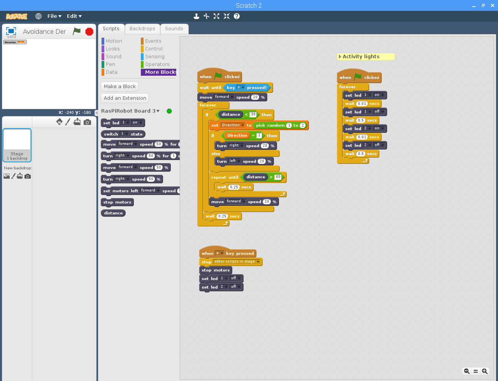
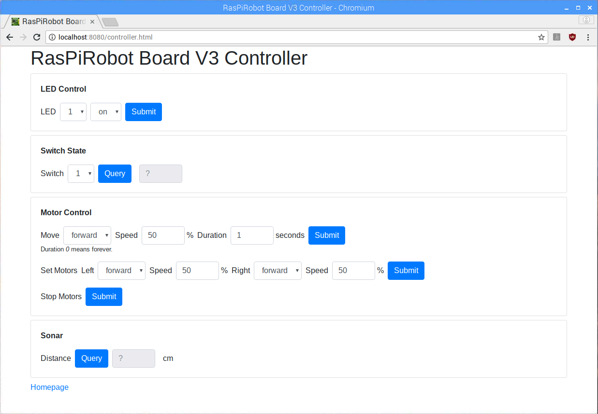

# RasPiRobot Board Scratch Extension

Control the Raspberry Pi expansion board *[RasPiRobot Board V3](https://www.monkmakes.com/rrb3/)* from the programming language *Scratch*. *[ScratchX](http://scratchx.org/#scratch)* and the *Scratch 2 Offline Editor* are supported.

The RasPiRobot Board V3 is made by [Monk Makes](https://www.monkmakes.com/). Scratch was developed by the MIT Media Lab.

## Compatibility

Tested with
* *Raspberry Pi 3 Model B*
* *RasPiRobot Board V3*
* *Rasbian Stretch with Desktop* Version *September 2017* with latest updates as of 24-Nov-2017
* *Python library for RasPiRobot Board V3* as of 12-Nov-2017
* *ScratchX* as of 23-Nov-2017
* *Scratch 2 Offline Editor* (as it comes with Raspbian, as of 24-Nov-2017)

## Approach

This extension comes with a server that needs to run on the Raspberry Pi that has the RasPiRobot Board V3 attached to it. The server exposes expansion board functionality through HTTP endpoints. It used the RasPiRobot Board V3 Python library to control the board. In Scratch an extension needs to be loaded. The extension exposes board functionality as additional Scratch blocks. Scratch can be running on the same computer as the server, or a different one. It needs to be able to connect to the server.

## Installation

### Rasbian

Download and install the latest [Rasbian](https://www.raspberrypi.org/downloads/raspbian/).

Update Rasbian with
 ```
 $ sudo apt update
 $ sudo apt upgrade
 ```

### Python library for RasPiRobot Board V3

See https://github.com/simonmonk/raspirobotboard3 for details.

```
$ cd ~
$ git clone https://github.com/simonmonk/raspirobotboard3.git
$ cd raspirobotboard3/python
$ sudo python setup.py install
```

### Scratch extension

```
$ cd ~
$ git clone https://github.com/markokimpel/rrbscratchextension.git
```

## Use Scratch

First, the server needs to be started.

```
$ cd ~/rrbscratchextension/rrbserver/
$ ./run.sh
Server listening at 0.0.0.0:8080

RRB3 Server homepage : http://<your_ip_addr>:8080/
Scratch extension URL: http://<your_ip_addr>:8080/scratch_extension.js

Press Ctrl-C to stop server
```

Open the RRB Server homepage with your browser to see detailed instructions on how to load the extension in ScratchX and the Scratch 2 Offline Editor.



There also is a Controller UI that allows you to control the board manually from your browser - great for testing.



# Left or right?

The use of *left*, *right*, *L* and *R* by Monk Makes can be confusing. I am using their [RasPiRobot Rover Kit](https://www.monkmakes.com/pi-rover/) that uses the RasPiRobot Board V3 as driver board. First, let's establish where rover's front is: it should be the direction the ultrasonic sensor is pointing to - because it's not very useful to measure distances at the rear of a rover, and their rover code samples also assume this to be the forward direction. Confusingly, if you follow the kit's instructions you will connect the left-hand side motor (relative to rover's front) to the port labeled *R* and the right-hand side motor to the port labeled *L*. The Scratch extension is consistent with that wiring. This has the advantage that you can use the rover sample code and Scratch extension without changing the wiring. If you use the expansion board to build your own rover, just remember to connect the left-hand side motor to the port labeled *R* and the right-hand side motor to the port labeled *L*. :smiley:

# GPIO usage

GPIO Pin (BCM) | Physical Pin | Usage
---: | ---: | ---
 4 |  7 | Right Motor 2
 7 | 26 | LED 2
 8 | 24 | LED 1
 9 | 21 | SW2
10 | 19 | Left Motor 1
11 | 23 | SW1
14 |  8 | Left Motor PWM
17 | 11 | Right Motor 1
18 | 12 | Trigger
22 | 15 | OC1
23 | 16 | Echo
24 | 18 | Right Motor PWM
25 | 22 | Left Motor 2
27 | 13 | OC2

# Security

The server exposes expansion board functionality through unsecured HTTP endpoints. Everyone with access to the endpoints can control the board. The server needs to be run in a network that guards against unauthorized access.
